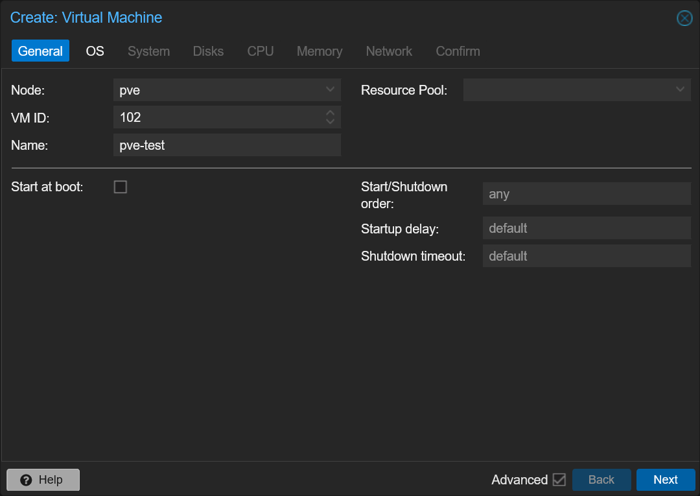
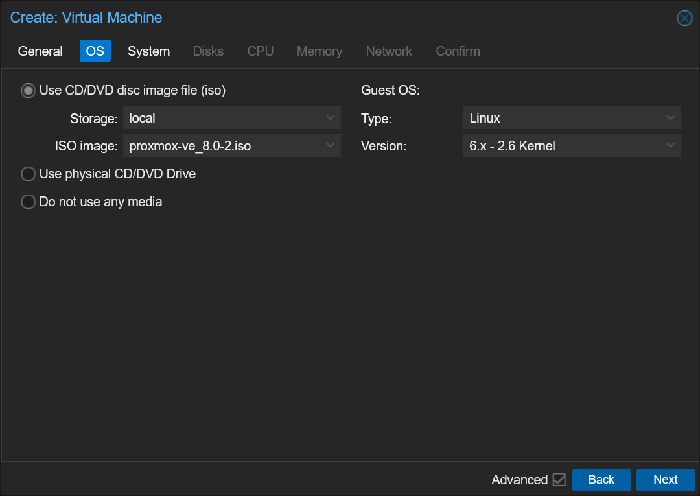
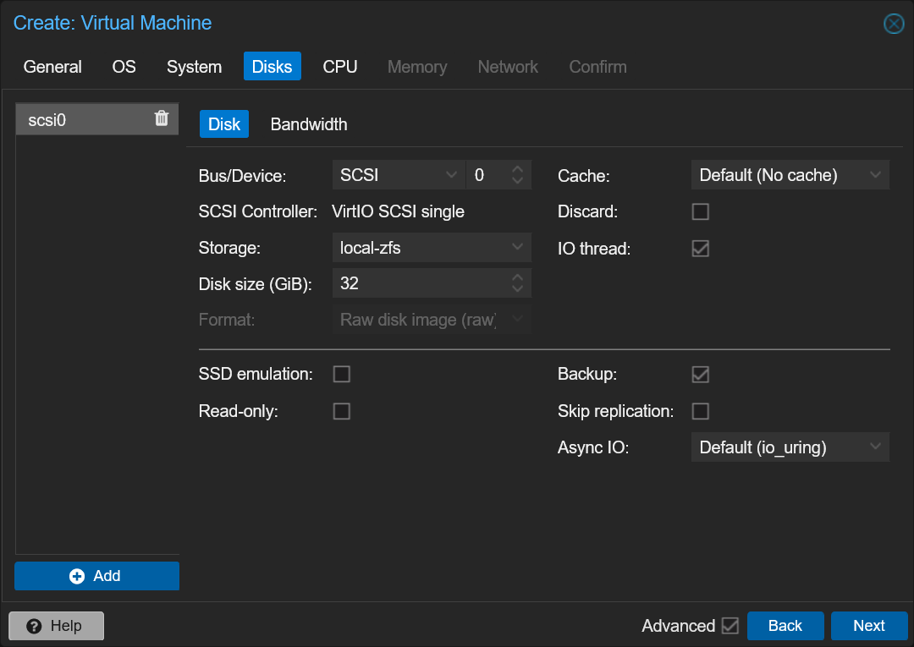
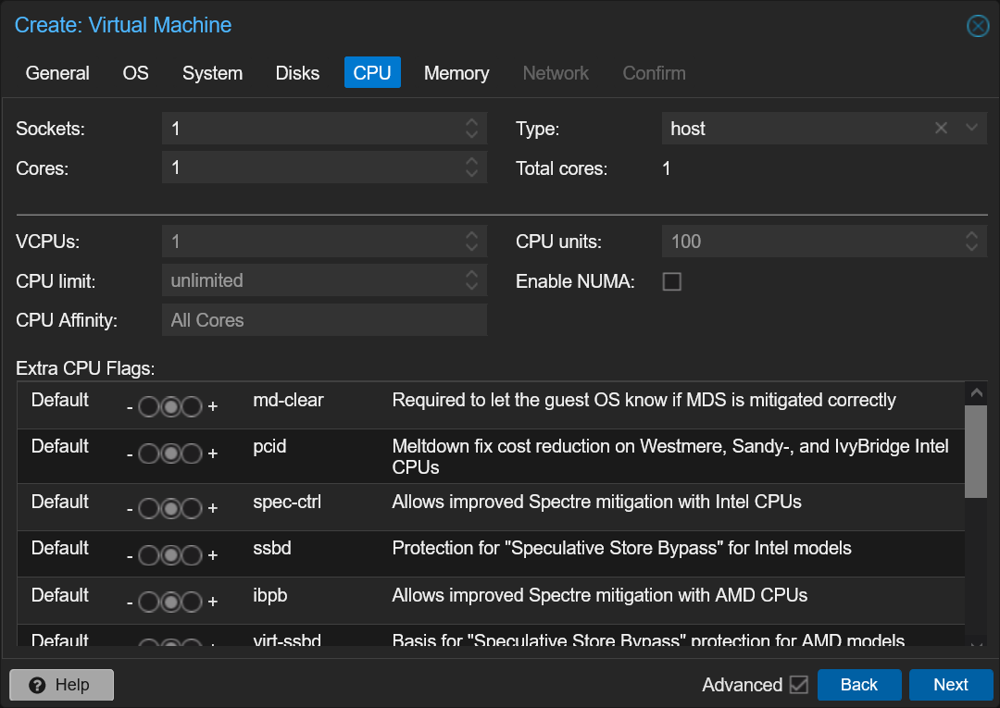
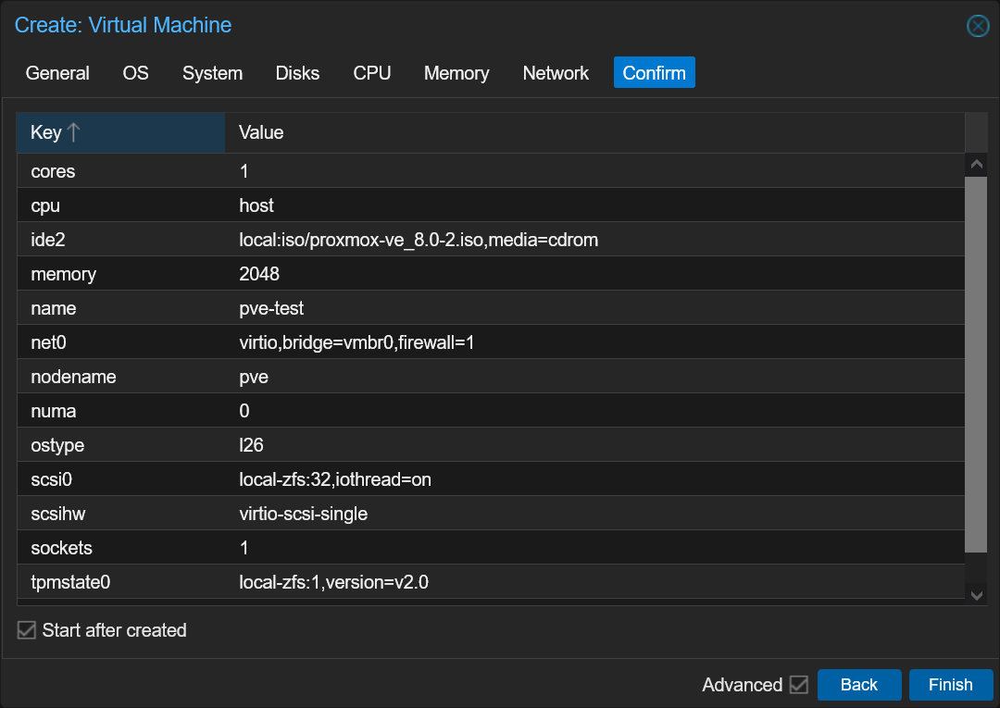
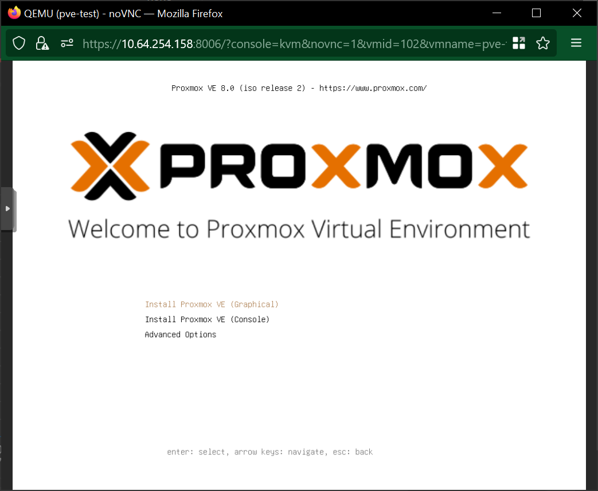
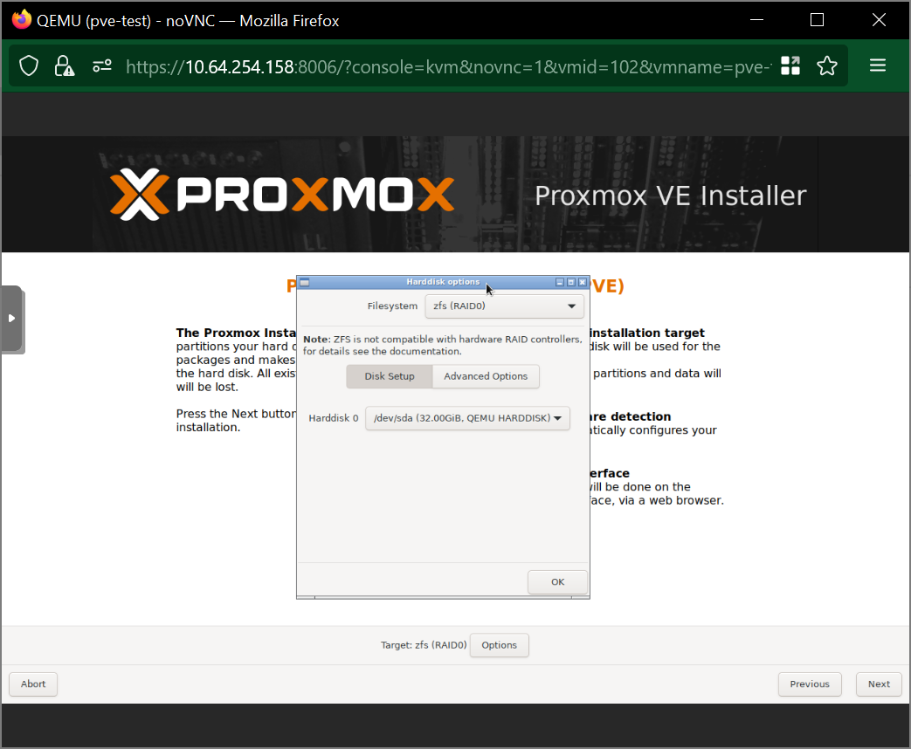
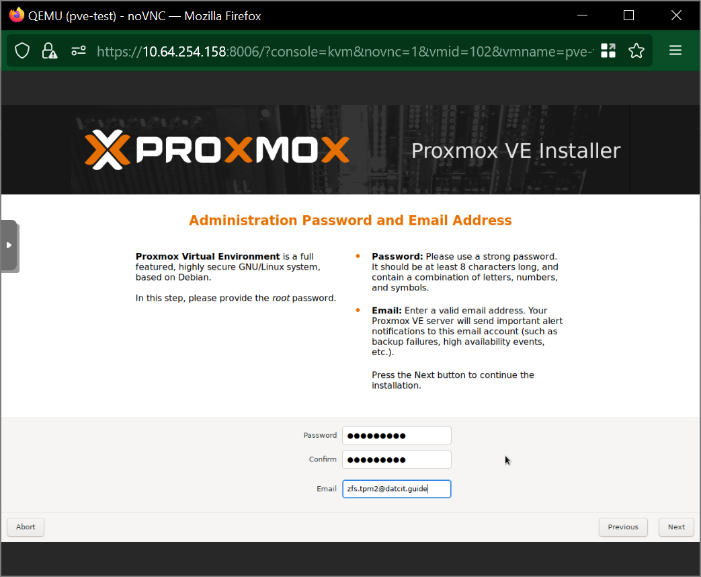
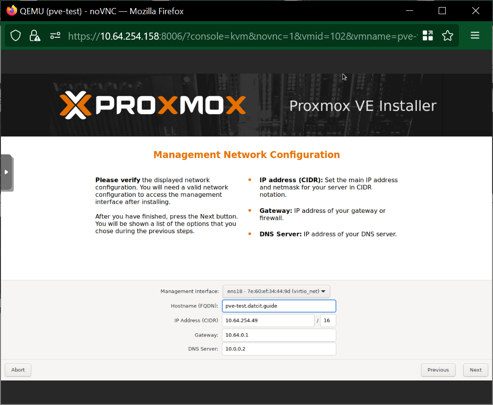

# Auto-Decrypting a ZFS Volume with TPM 2.0 Module
I've wanted to auto-decrypt my ZFS volumes so that when my server boots, the 
volume is automatically decrypted for immediate use. This means I won't need to 
SSH into the box and enter the key manually. The desire to encrypt the volume, 
and the data inside it, is to ensure that if I ever have to RMA, sell, or 
otherwise dispose of a drive, my family's private data will remain secure. 
After many failed attempts to achieve this, I've finally succeeded. 
Here's how I did it.

## Assumptions
I've accomplished this on both `v8.0.4` and `v7.4-16` of Proxmox Virtual Environment (PVE) also known as Proxmox VE. 
While these instructions *"***should***"* theoretically work for Ubuntu 22.04, I have not 
tested them on any other distro than Proxmox. In this guide, I assume that you already have a ZFS
pool named `rpool`. I will not go over how to create a ZFS pool in this guide. 
If your pool is named something other than `rpool` just replace `rpool` with the 
name of your pool when following this guide.

## Step 0
<details>
<summary>Optional but Recommended</summary>
While it isn't necessary, I would recommend running through this guide in a VM 
as to remove the concern of breaking something as well as familiarizing yourself 
with the process.
  
### Step 0.1
Create a VM running PVE to familiarize yourself with this guide before 
putting it to use in production. Consider the following settings:
  - General > Start at boot: disabled (unchecked)


  - System > Add TPM: enabled (checked)
  - System > TPM Storage: Your Choice
  - System > TPM Version: 2.0


  - CPU > Sockets: 1
  - CPU > Cores: 1
  - CPU > Type: Host

  - Memory > Memory (MiB): 2048




### Step 0.2
In the console select `Install Proxmox VE (Graphical)`

### Step 0.3
Agree to the user agreement if you do, else we can't proceed.

### Step 0.4
At the target Harddisk click the `Options` button and select `zfs (RAID0)` 
from the filesystem dropdown and click `OK`


### Step 0.5
Make your appropriate selections for Location and Time zone selection.

### Step 0.6
Give it a password and email address. It isn't imperative that you remember 
these values past this guide as when we are done, you should discard this VM.

### Step 0.7
Complete the remainder of the setup process as you normally would.

## Step 0.8
Confirm your details than click the "install" button


## Step 0.9
After a few minutes and the VM automaticly reboots itself, you should reach a 
terminal login prompt. Take note of the IP URL. In my case it is https://10.64.254.49:8006/


## Step 0.10
Close this window and navigate to your URL IP. Follow the remaining steps below in your 
VM without fear of loosing data or breaking something. After you have completed this guide 
in the VM you can delete the VM and proceed with going through the guide starting at Step 1
with your production server if you so choose.
</details>

## Step 1
Before installing new packages, always ensure that your package index files and 
the system itself are up-to-date. To do this, click the "Refresh" button in the 
Proxmox VE web-ui. Once you see **`TASK OK`**, close the "Task Viewer" modal 
window and then click the "Upgrade" button.

## Step 2
At this point, you should have the "Proxmox Console" window open.
To proceed, install the `tpm2-tools` package. Run the following command in the 
"Proxmox Console":
```bash
apt install -y tpm2-tools
```

## Step 3
Define (or allocate) a Non-Volatile (NV) storage index within the TPM. 
```bash
tpm2_nvdefine -s 64 0x01800016
```
-   `-s 64`: The `-s` option specifies the size of the data area to allocate in bytes.
In this command, 64 bytes are being allocated.
-   `0x01800016`: This is the NV index to define. The index is presented in hexadecimal format.
It falls within the range of 0x01800000 to 0x01BFFFFF which is [reserved for the system owner to use](https://web.archive.org/web/20221027162903/https://trustedcomputinggroup.org/wp-content/uploads/RegistryOfReservedTPM2HandlesAndLocalities_v1p1_pub.pdf) for "OS or application specific usages."

## Step 4
Now lets create a temporary [RAM Disk](https://en.wikipedia.org/wiki/RAM_drive) as we don't 
want to store our key on physical disk because that would defeat the purpose of this exercise.
```bash
mkdir /ramdisk
mount -t tmpfs -o size=64k tmpfs /ramdisk
```
## Step 5
At this point, I will demonstrate two options, we can generate a new key OR we can use our 
existing key.

<details>
<summary>Option A: Generate new key</summary>

Lets generate a  64-byte key made of letters and number and store it on our 
ramdisk in a file named `root.key`
```bash 
cat /dev/urandom | tr -dc 'a-zA-Z0-9' | head -c 64 > /ramdisk/root.key
```
</details>

<details>
<summary>Option B: Use existing key</summary>
  
Use your favorite text editor such as `nano` or `vim` to store your passphrase in a 
new file `/ramdisk/root.key`

</details>

## Step 6
Following that, write the key to the TPM2 at the NV storage index defined earlier:
```bash
tpm2_nvwrite -i /ramdisk/root.key 0x01800016
```
## Step 7
Now, verify that the key file and what's stored in the TPM2 match:
```bash
RED='\033[0;31m'
GREEN='\033[0;32m'
NOCOLOR='\033[0m'
TPM_VALUE=$(tpm2_nvread  0x01800016  2> /dev/null)
KEY_VALUE=$(cat /ramdisk/root.key)
[[ $TPM_VALUE  ==  $KEY_VALUE ]] && echo -e "\n${GREEN}Safe to continue${NOCOLOR}\n"  ||  echo -e "\n${RED}DO NOT PROCEED!${NOCOLOR}\n"
```
If you receive a "Safe to continue" message in green, you may proceed to the next step. If you receive a message in red stating "DO NOT PROCEED!", troubleshoot the issue until you have resolved it.

## Step 8
Store the root.key value in a trusted location like your Bitwarden Vault. 

## Step 9
Once you're certain that you've saved the `root.key` value in a secure 
location separate from the server, you can safely dispose of the file:
```bash
umount /ramdisk
rm -rf /ramdisk
```
## Step 10
Now, if you don't already have a encrypted volume, we should create a new volume.
<details>
<summary>Optional: Create a new volume</summary>
  
```bash
zfs create -o encryption=on -o keylocation=prompt -o keyformat=passphrase rpool/encrypted
```
You will be prompted for a `passphrase` paste in the key value you stored in a safe place.

If this is a newly created volume without data in it, you may want to create some child datasets
for testing purposes.
```bash
zfs create rpool/encrypted/child1
zfs create rpool/encrypted/child2
zfs create rpool/encrypted/child3
```

</details>

## Step 11
If you don't already have data in your volume, use wget to download a text file of book in the [Public Doamin](https://en.wikipedia.org/wiki/Public_domain).
```bash
wget -qO /rpool/encrypted/child2/common_sense.txt http://textfiles.com/etext/NONFICTION/common_sense
```
Lets verify we can read the file
```bash
tail /rpool/encrypted/child2/common_sense.txt
```
## Step 12
Now lets test decrypting our volume using the TPM2.

First we will unmount the encrypted volume and unload the key.
```bash
zfs unmount rpool/encrypted
zfs unload-key -r rpool/encrypted
```
Lets try to re-mount the volume. This should fail and give you an 
error `cannot mount 'rpool/encrypted': encryption key not loaded`
```bash
zfs mount rpool/encrypted
```
For giggles, lets see if we can read that book again. You should get an error 
stating `No such file or directory`
```bash
tail /rpool/encrypted/child2/common_sense.txt
```
## Step 13
Now lets decrypt the volume with the TPM2 and mount all child datasets
```bash
tpm2_nvread -s 64 0x01800016 | zfs load-key rpool/encrypted
zfs list -rH -o name rpool/encrypted | xargs -L 1 zfs mount
```
## Step 14
Now lets automate this. We will schedule tasks with the system via `crontab` such that 
when the system boots, it will automatically decrypt our volume. If this is your first time 
running `crontab` it will prompt you to select an editor. If you aren't familar with using
`vim` use `nano` like it suggests.
```bash
crontab -e
```
At the bottom of the file add the following lines:
```bash
@reboot tpm2_nvread -s 64 0x01800016 | zfs load-key rpool/encrypted && zfs list -rH -o name rpool/encrypted | xargs -L 1 zfs mount
```
Reboot `shutdown -r now` or shutdown `shutdown -h now` your system.

When your system comes back online you should now be able to access the book you saved
without need to manualy decrypt or mount the disk.
```bash
tail /rpool/encrypted/child2/common_sense.txt
```

## Step 15
Profit


## Useful Commands
With no arguments, the `zpool list` command displays the following information for all pools on the system:
```bash
root@pve:~# zpool list
NAME    SIZE  ALLOC   FREE  CKPOINT  EXPANDSZ   FRAG    CAP  DEDUP    HEALTH  ALTROOT
rpool    31G  1.85G  29.1G        -         -     0%     5%  1.00x    ONLINE  -
```

## Useful Resources
The following pages I found usefull when learning what I did in order to put together this guide
- [A quick-start guide to OpenZFS native encryption](https://web.archive.org/web/20230723203617/https://arstechnica.com/gadgets/2021/06/a-quick-start-guide-to-openzfs-native-encryption/)
- [Ubuntu 20.04 and TPM2 encrypted system disk](https://web.archive.org/web/20230419155357/https://run.tournament.org.il/ubuntu-20-04-and-tpm2-encrypted-system-disk/)
